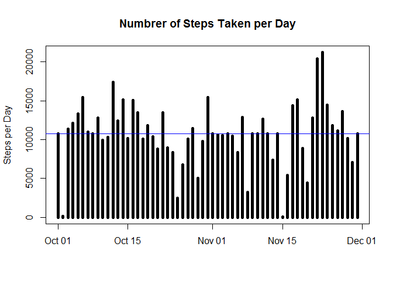
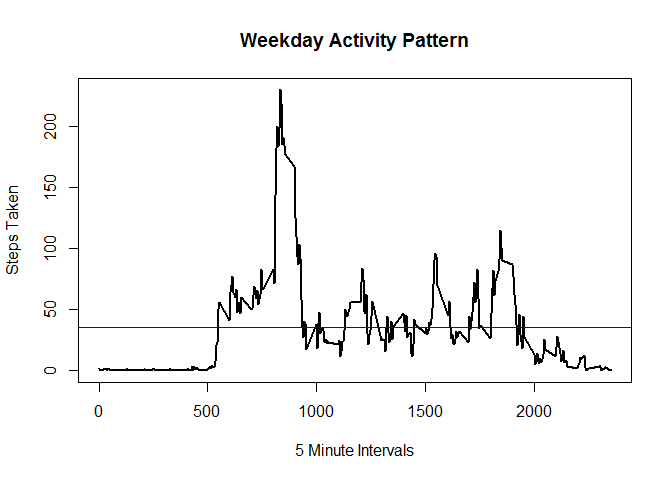
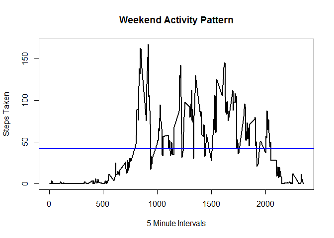

---
title: "PA1_template.Rmd"
output: html_document
---

## Introduction

It is now possible to collect a large amount of data about personal
movement using activity monitoring devices such as a
[Fitbit](http://www.fitbit.com), [Nike
Fuelband](http://www.nike.com/us/en_us/c/nikeplus-fuelband), or
[Jawbone Up](https://jawbone.com/up). These type of devices are part of
the "quantified self" movement -- a group of enthusiasts who take
measurements about themselves regularly to improve their health, to
find patterns in their behavior, or because they are tech geeks. But
these data remain under-utilized both because the raw data are hard to
obtain and there is a lack of statistical methods and software for
processing and interpreting the data.

This assignment makes use of data from a personal activity monitoring
device. This device collects data at 5 minute intervals through out the
day. The data consists of two months of data from an anonymous
individual collected during the months of October and November, 2012
and include the number of steps taken in 5 minute intervals each day.


## Data

The data for this assignment can be downloaded from the course web
site:

* Dataset: [Activity monitoring data](https://d396qusza40orc.cloudfront.net/repdata%2Fdata%2Factivity.zip) [52K]

The variables included in this dataset are:

* **steps**: Number of steps taking in a 5-minute interval (missing
    values are coded as `NA`)

* **date**: The date on which the measurement was taken in YYYY-MM-DD
    format

* **interval**: Identifier for the 5-minute interval in which
    measurement was taken

The dataset is stored in a comma-separated-value (CSV) file and there
are a total of 17,568 observations in this
dataset.


## Assignment

This assignment will be described in multiple parts. You will need to
write a report that answers the questions detailed below. Ultimately,
you will need to complete the entire assignment in a **single R
markdown** document that can be processed by **knitr** and be
transformed into an HTML file.

Throughout your report make sure you always include the code that you
used to generate the output you present. When writing code chunks in
the R markdown document, always use `echo = TRUE` so that someone else
will be able to read the code. **This assignment will be evaluated via
peer assessment so it is essential that your peer evaluators be able
to review the code for your analysis**.

For the plotting aspects of this assignment, feel free to use any
plotting system in R (i.e., base, lattice, ggplot2)

Fork/clone the [GitHub repository created for this
assignment](http://github.com/rdpeng/RepData_PeerAssessment1). You
will submit this assignment by pushing your completed files into your
forked repository on GitHub. The assignment submission will consist of
the URL to your GitHub repository and the SHA-1 commit ID for your
repository state.


### Loading and preprocessing the data

The first step in this analysis is to load the data into R. The first step is to set the working directory to the file that contains the activity.csv file. You do this with **"setwd()"**

I loaded the data into a variable called **"data_activity"** using the **"read.csv"** function. I also set the header argument to **"TRUE"**, and identified NA values with the **"na.strings"** argument.


```r
data_activity <- read.csv("activity.csv", header = T, na.strings = "NA")
```

Next I turned the date column into a POSIXlt data using the **"as.Date"** function with the format of **"YYYY-MM-DD"**.


```r
data_activity$date <- as.Date(data_activity$date, format = "%Y-%m-%d")
```


### What is mean total number of steps taken per day?

The fist set is to plot a histogram of the total number of steps taken each day. To do this I will **"aggregate"** function to add steps together for each day. Next I use the base ploting system to create a histogram using the **"type="h""** argument. I also added a mean line using the **"abline"** function.


```r
## Calculate number of steps per day
total_steps <- aggregate(steps~date,data_activity, sum)

## Plot Histogram of number of steps per day
plot(total_steps, type="h", main = "Number of Steps Taken per Day", lwd=5, xlab="", ylab="Steps per Day")
abline(h=mean(total_steps$steps), col="blue")
```

<!-- -->

The next step is to calculate and report the **mean** and **median** total number of steps taken per day. This is done using the **"mean"** and **"median"** fucntions.


```r
## Calculate mean of the steps taken per day
mean_steps <- mean(total_steps$steps, na.rm=T)
mean_steps
```

```
## [1] 10766.19
```

```r
median_steps <- median(total_steps$steps, na.rm=T)
median_steps
```

```
## [1] 10765
```


### What is the average daily activity pattern?

The next task is to see what the average daily activity looks like. To do this we need to discover the average number of steps take for each 5 minute interval during the day. This is done by using the **"aggregate"** function and setting it to calculate **"steps~interval"**.


```r
## What is the average daily activity pattern?
step_interval <- aggregate(steps~interval, data_activity, mean, na.rm=T)
```

We plot this data as a line graph by setting the **"type="l""** agrument in the base plotting system.


```r
## Plot activity pattern
plot(step_interval, type="l", main= "Daily Activity Pattern", lwd=2, xlab="5 Minute Intervals", ylab="Steps Taken")
abline(h=mean(step_interval$steps), col="blue")
```

<!-- -->

## Which 5-minute interval, on average across all the days in the dataset, contains the maximum number of steps?

```r
step_interval[which.max(step_interval$steps),]
```

```
##     interval    steps
## 104      835 206.1698
```

```r
step_interval
```

```
##     interval       steps
## 1          0   1.7169811
## 2          5   0.3396226
## 3         10   0.1320755
## 4         15   0.1509434
## 5         20   0.0754717
## 6         25   2.0943396
## 7         30   0.5283019
## 8         35   0.8679245
## 9         40   0.0000000
## 10        45   1.4716981
## 11        50   0.3018868
## 12        55   0.1320755
## 13       100   0.3207547
## 14       105   0.6792453
## 15       110   0.1509434
## 16       115   0.3396226
## 17       120   0.0000000
## 18       125   1.1132075
## 19       130   1.8301887
## 20       135   0.1698113
## 21       140   0.1698113
## 22       145   0.3773585
## 23       150   0.2641509
## 24       155   0.0000000
## 25       200   0.0000000
## 26       205   0.0000000
## 27       210   1.1320755
## 28       215   0.0000000
## 29       220   0.0000000
## 30       225   0.1320755
## 31       230   0.0000000
## 32       235   0.2264151
## 33       240   0.0000000
## 34       245   0.0000000
## 35       250   1.5471698
## 36       255   0.9433962
## 37       300   0.0000000
## 38       305   0.0000000
## 39       310   0.0000000
## 40       315   0.0000000
## 41       320   0.2075472
## 42       325   0.6226415
## 43       330   1.6226415
## 44       335   0.5849057
## 45       340   0.4905660
## 46       345   0.0754717
## 47       350   0.0000000
## 48       355   0.0000000
## 49       400   1.1886792
## 50       405   0.9433962
## 51       410   2.5660377
## 52       415   0.0000000
## 53       420   0.3396226
## 54       425   0.3584906
## 55       430   4.1132075
## 56       435   0.6603774
## 57       440   3.4905660
## 58       445   0.8301887
## 59       450   3.1132075
## 60       455   1.1132075
## 61       500   0.0000000
## 62       505   1.5660377
## 63       510   3.0000000
## 64       515   2.2452830
## 65       520   3.3207547
## 66       525   2.9622642
## 67       530   2.0943396
## 68       535   6.0566038
## 69       540  16.0188679
## 70       545  18.3396226
## 71       550  39.4528302
## 72       555  44.4905660
## 73       600  31.4905660
## 74       605  49.2641509
## 75       610  53.7735849
## 76       615  63.4528302
## 77       620  49.9622642
## 78       625  47.0754717
## 79       630  52.1509434
## 80       635  39.3396226
## 81       640  44.0188679
## 82       645  44.1698113
## 83       650  37.3584906
## 84       655  49.0377358
## 85       700  43.8113208
## 86       705  44.3773585
## 87       710  50.5094340
## 88       715  54.5094340
## 89       720  49.9245283
## 90       725  50.9811321
## 91       730  55.6792453
## 92       735  44.3207547
## 93       740  52.2641509
## 94       745  69.5471698
## 95       750  57.8490566
## 96       755  56.1509434
## 97       800  73.3773585
## 98       805  68.2075472
## 99       810 129.4339623
## 100      815 157.5283019
## 101      820 171.1509434
## 102      825 155.3962264
## 103      830 177.3018868
## 104      835 206.1698113
## 105      840 195.9245283
## 106      845 179.5660377
## 107      850 183.3962264
## 108      855 167.0188679
## 109      900 143.4528302
## 110      905 124.0377358
## 111      910 109.1132075
## 112      915 108.1132075
## 113      920 103.7169811
## 114      925  95.9622642
## 115      930  66.2075472
## 116      935  45.2264151
## 117      940  24.7924528
## 118      945  38.7547170
## 119      950  34.9811321
## 120      955  21.0566038
## 121     1000  40.5660377
## 122     1005  26.9811321
## 123     1010  42.4150943
## 124     1015  52.6603774
## 125     1020  38.9245283
## 126     1025  50.7924528
## 127     1030  44.2830189
## 128     1035  37.4150943
## 129     1040  34.6981132
## 130     1045  28.3396226
## 131     1050  25.0943396
## 132     1055  31.9433962
## 133     1100  31.3584906
## 134     1105  29.6792453
## 135     1110  21.3207547
## 136     1115  25.5471698
## 137     1120  28.3773585
## 138     1125  26.4716981
## 139     1130  33.4339623
## 140     1135  49.9811321
## 141     1140  42.0377358
## 142     1145  44.6037736
## 143     1150  46.0377358
## 144     1155  59.1886792
## 145     1200  63.8679245
## 146     1205  87.6981132
## 147     1210  94.8490566
## 148     1215  92.7735849
## 149     1220  63.3962264
## 150     1225  50.1698113
## 151     1230  54.4716981
## 152     1235  32.4150943
## 153     1240  26.5283019
## 154     1245  37.7358491
## 155     1250  45.0566038
## 156     1255  67.2830189
## 157     1300  42.3396226
## 158     1305  39.8867925
## 159     1310  43.2641509
## 160     1315  40.9811321
## 161     1320  46.2452830
## 162     1325  56.4339623
## 163     1330  42.7547170
## 164     1335  25.1320755
## 165     1340  39.9622642
## 166     1345  53.5471698
## 167     1350  47.3207547
## 168     1355  60.8113208
## 169     1400  55.7547170
## 170     1405  51.9622642
## 171     1410  43.5849057
## 172     1415  48.6981132
## 173     1420  35.4716981
## 174     1425  37.5471698
## 175     1430  41.8490566
## 176     1435  27.5094340
## 177     1440  17.1132075
## 178     1445  26.0754717
## 179     1450  43.6226415
## 180     1455  43.7735849
## 181     1500  30.0188679
## 182     1505  36.0754717
## 183     1510  35.4905660
## 184     1515  38.8490566
## 185     1520  45.9622642
## 186     1525  47.7547170
## 187     1530  48.1320755
## 188     1535  65.3207547
## 189     1540  82.9056604
## 190     1545  98.6603774
## 191     1550 102.1132075
## 192     1555  83.9622642
## 193     1600  62.1320755
## 194     1605  64.1320755
## 195     1610  74.5471698
## 196     1615  63.1698113
## 197     1620  56.9056604
## 198     1625  59.7735849
## 199     1630  43.8679245
## 200     1635  38.5660377
## 201     1640  44.6603774
## 202     1645  45.4528302
## 203     1650  46.2075472
## 204     1655  43.6792453
## 205     1700  46.6226415
## 206     1705  56.3018868
## 207     1710  50.7169811
## 208     1715  61.2264151
## 209     1720  72.7169811
## 210     1725  78.9433962
## 211     1730  68.9433962
## 212     1735  59.6603774
## 213     1740  75.0943396
## 214     1745  56.5094340
## 215     1750  34.7735849
## 216     1755  37.4528302
## 217     1800  40.6792453
## 218     1805  58.0188679
## 219     1810  74.6981132
## 220     1815  85.3207547
## 221     1820  59.2641509
## 222     1825  67.7735849
## 223     1830  77.6981132
## 224     1835  74.2452830
## 225     1840  85.3396226
## 226     1845  99.4528302
## 227     1850  86.5849057
## 228     1855  85.6037736
## 229     1900  84.8679245
## 230     1905  77.8301887
## 231     1910  58.0377358
## 232     1915  53.3584906
## 233     1920  36.3207547
## 234     1925  20.7169811
## 235     1930  27.3962264
## 236     1935  40.0188679
## 237     1940  30.2075472
## 238     1945  25.5471698
## 239     1950  45.6603774
## 240     1955  33.5283019
## 241     2000  19.6226415
## 242     2005  19.0188679
## 243     2010  19.3396226
## 244     2015  33.3396226
## 245     2020  26.8113208
## 246     2025  21.1698113
## 247     2030  27.3018868
## 248     2035  21.3396226
## 249     2040  19.5471698
## 250     2045  21.3207547
## 251     2050  32.3018868
## 252     2055  20.1509434
## 253     2100  15.9433962
## 254     2105  17.2264151
## 255     2110  23.4528302
## 256     2115  19.2452830
## 257     2120  12.4528302
## 258     2125   8.0188679
## 259     2130  14.6603774
## 260     2135  16.3018868
## 261     2140   8.6792453
## 262     2145   7.7924528
## 263     2150   8.1320755
## 264     2155   2.6226415
## 265     2200   1.4528302
## 266     2205   3.6792453
## 267     2210   4.8113208
## 268     2215   8.5094340
## 269     2220   7.0754717
## 270     2225   8.6981132
## 271     2230   9.7547170
## 272     2235   2.2075472
## 273     2240   0.3207547
## 274     2245   0.1132075
## 275     2250   1.6037736
## 276     2255   4.6037736
## 277     2300   3.3018868
## 278     2305   2.8490566
## 279     2310   0.0000000
## 280     2315   0.8301887
## 281     2320   0.9622642
## 282     2325   1.5849057
## 283     2330   2.6037736
## 284     2335   4.6981132
## 285     2340   3.3018868
## 286     2345   0.6415094
## 287     2350   0.2264151
## 288     2355   1.0754717
```

### Imputing missing values
First lets see how many missing values we have in our data using the **"sum"** and **"complete.cases"** arguments.


```r
total_na <- sum(!complete.cases(data_activity$steps))
total_na
```

```
## [1] 2304
```

I decided to fill all missing values with the average activity for that time interval. To do this I made a for loop over the average steps per interval that was calculated earlier. The script looks for interval times that math the average steps per interval and are missing step data. When both these conditions are met the for loop replaces the missing value with the average steps during that interval.


```r
## Make copy of the activity data
data_fill <- data_activity
## Create a for loop which replaces missing values with the average for that interval. 
for (i in step_interval){
        data_fill[data_fill$interval == i & is.na(data_fill$steps),]$steps <- step_interval$steps[step_interval$interval==i]
}
```

Now that we have filled the missing values we can calculate the total number of steps taken each day using the same method we used in the first part of this project.

```r
## Calculate number of steps per day
total_steps_fill <- aggregate(steps~date, data_fill, sum)

## Plot Histogram of number of steps per day
plot(total_steps_fill, type="h", main = "Numbrer of Steps Taken per Day", lwd=5, xlab="", ylab="Steps per Day")
abline(h=mean(total_steps$steps), col="blue")
```

<!-- -->

We also want to know if filling these missing values will change the median or mean. Again we do this the same way we did it in the first section. 


```r
## Calculate mean of the steps taken per day
mean_steps_fill <- mean(total_steps_fill$steps, na.rm=T)
mean_steps_fill
```

```
## [1] 10766.19
```

```r
## Calculate media of the steps taken per day
median_steps_fill <- median(total_steps_fill$steps, na.rm=T)
median_steps_fill
```

```
## [1] 10766.19
```


### Are there differences in activity patterns between weekdays and weekends?

With the new data set that does not contain missing values we want to see if there is a difference in activity on weekdays or weekends. The fist step is to create a new column that will identify if the date falls on a weekday or weekend. To do this we use the **"weekdays"** function to identify which day of the week it is. The **"ifelse"** fucntion will return **"weekend"** when for Saturday or Sunda, and will return weekday for all other values. 


```r
data_week <- data_fill
data_week$weektime <- as.factor(ifelse(weekdays(data_week$date) %in% c("Saturday","Sunday"),"weekend", "weekday"))
```

Next we subset the data based off the newly created weektime column.


```r
Weekday_data <- subset(data_week, weektime=="weekday")
Weekend_data <- subset(data_week, weektime=="weekend")
```

The next step is to use the **"aggregate"** function to calculate the mean steps for each time interval in both of the new data sets.


```r
weekday_plot <- aggregate(steps~interval, Weekday_data, mean)
weekend_plot  <- aggregate(steps~interval, Weekend_data, mean)
```


Finally we plot the two data sets with time intervals on the x axis and the steps taken on the y axis.

```r
plot(weekday_plot$interval, weekday_plot$steps, type = "l",main= "Weekday Activity Pattern", lwd=2, xlab="5 Minute Intervals", ylab="Steps Taken")
abline(h=mean(weekday_plot$steps), col="blue")
```

<!-- -->

```r
plot(weekend_plot$interval, weekend_plot$steps, type = "l",main= "Weekend Activity Pattern", lwd=2, xlab="5 Minute Intervals", ylab="Steps Taken")
  abline(h=mean(weekend_plot$steps), col="blue")
```

<!-- -->
