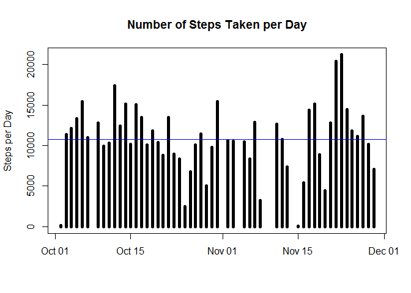
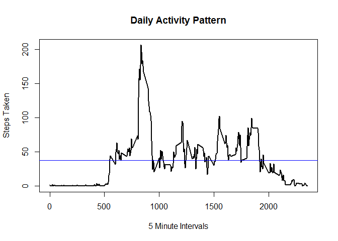
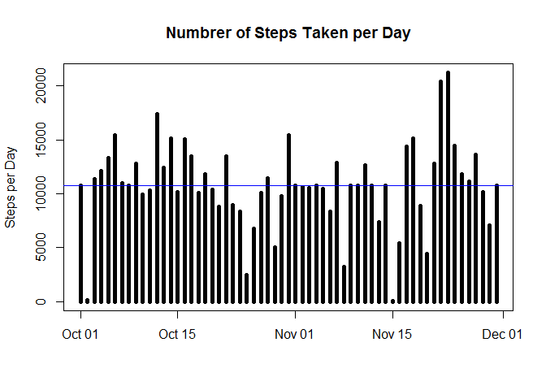
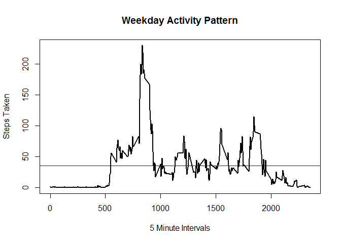
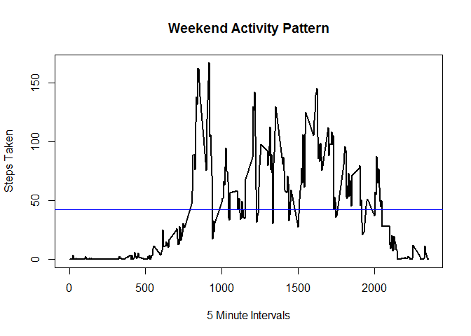

---
title: "PA1_template.Rmd"
output: html_document
---

## Introduction

It is now possible to collect a large amount of data about personal
movement using activity monitoring devices such as a
[Fitbit](http://www.fitbit.com), [Nike
Fuelband](http://www.nike.com/us/en_us/c/nikeplus-fuelband), or
[Jawbone Up](https://jawbone.com/up). These type of devices are part of
the "quantified self" movement -- a group of enthusiasts who take
measurements about themselves regularly to improve their health, to
find patterns in their behavior, or because they are tech geeks. But
these data remain under-utilized both because the raw data are hard to
obtain and there is a lack of statistical methods and software for
processing and interpreting the data.

This assignment makes use of data from a personal activity monitoring
device. This device collects data at 5 minute intervals through out the
day. The data consists of two months of data from an anonymous
individual collected during the months of October and November, 2012
and include the number of steps taken in 5 minute intervals each day.


## Data

The data for this assignment can be downloaded from the course web
site:

* Dataset: [Activity monitoring data](https://d396qusza40orc.cloudfront.net/repdata%2Fdata%2Factivity.zip) [52K]

The variables included in this dataset are:

* **steps**: Number of steps taking in a 5-minute interval (missing
    values are coded as `NA`)

* **date**: The date on which the measurement was taken in YYYY-MM-DD
    format

* **interval**: Identifier for the 5-minute interval in which
    measurement was taken

The dataset is stored in a comma-separated-value (CSV) file and there
are a total of 17,568 observations in this
dataset.


## Assignment

This assignment will be described in multiple parts. You will need to
write a report that answers the questions detailed below. Ultimately,
you will need to complete the entire assignment in a **single R
markdown** document that can be processed by **knitr** and be
transformed into an HTML file.

Throughout your report make sure you always include the code that you
used to generate the output you present. When writing code chunks in
the R markdown document, always use `echo = TRUE` so that someone else
will be able to read the code. **This assignment will be evaluated via
peer assessment so it is essential that your peer evaluators be able
to review the code for your analysis**.

For the plotting aspects of this assignment, feel free to use any
plotting system in R (i.e., base, lattice, ggplot2)

Fork/clone the [GitHub repository created for this
assignment](http://github.com/rdpeng/RepData_PeerAssessment1). You
will submit this assignment by pushing your completed files into your
forked repository on GitHub. The assignment submission will consist of
the URL to your GitHub repository and the SHA-1 commit ID for your
repository state.


### Loading and preprocessing the data

The first step in this analysis is to load the data into R. The first step is to set the working directory to the file that contains the activity.csv file. You do this with **"setwd()"**

I loaded the data into a variable called **"data_activity"** using the **"read.csv"** function. I also set the header argument to **"TRUE"**, and identified NA values with the **"na.strings"** argument.


```r
data_activity <- read.csv("activity.csv", header = T, na.strings = "NA")
```

Next I turned the date column into a POSIXlt data using the **"as.Date"** function with the format of **"YYYY-MM-DD"**.


```r
data_activity$date <- as.Date(data_activity$date, format = "%Y-%m-%d")
```


### What is mean total number of steps taken per day?

The fist set is to plot a histogram of the total number of steps taken each day. To do this I will **"aggregate"** function to add steps together for each day. Next I use the base ploting system to create a histogram using the **"type="h""** argument. I also added a mean line using the **"abline"** function.


```r
## Calculate number of steps per day
total_steps <- aggregate(steps~date,data_activity, sum)

## Plot Histogram of number of steps per day
plot(total_steps, type="h", main = "Number of Steps Taken per Day", lwd=5, xlab="", ylab="Steps per Day")
abline(h=mean(total_steps$steps), col="blue")
```

<!-- -->

The next step is to calculate and report the **mean** and **median** total number of steps taken per day. This is done using the **"mean"** and **"median"** fucntions.


```r
## Calculate mean of the steps taken per day
mean_steps <- mean(total_steps$steps, na.rm=T)
mean_steps
```

```
## [1] 10766.19
```

```r
median_steps <- median(total_steps$steps, na.rm=T)
median_steps
```

```
## [1] 10765
```


### What is the average daily activity pattern?

The next task is to see what the average daily activity looks like. To do this we need to discover the average number of steps take for each 5 minute interval during the day. This is done by using the **"aggregate"** function and setting it to calculate **"steps~interval"**.


```r
## What is the average daily activity pattern?
step_interval <- aggregate(steps~interval, data_activity, mean, na.rm=T)
```

We plot this data as a line graph by setting the **"type="l""** agrument in the base plotting system.


```r
## Plot activity pattern
plot(step_interval, type="l", main= "Daily Activity Pattern", lwd=2, xlab="5 Minute Intervals", ylab="Steps Taken")
abline(h=mean(step_interval$steps), col="blue")
```

<!-- -->


### Imputing missing values
First lets see how many missing values we have in our data using the **"sum"** and **"complete.cases"** arguments.


```r
total_na <- sum(!complete.cases(data_activity$steps))
total_na
```

```
## [1] 2304
```

I decided to fill all missing values with the average activity for that time interval. To do this I made a for loop over the average steps per interval that was calculated earlier. The script looks for interval times that math the average steps per interval and are missing step data. When both these conditions are met the for loop replaces the missing value with the average steps during that interval.


```r
## Make copy of the activity data
data_fill <- data_activity
## Create a for loop which replaces missing values with the average for that interval. 
for (i in step_interval){
        data_fill[data_fill$interval == i & is.na(data_fill$steps),]$steps <- step_interval$steps[step_interval$interval==i]
}
```

Now that we have filled the missing values we can calculate the total number of steps taken each day using the same method we used in the first part of this project.

```r
## Calculate number of steps per day
total_steps_fill <- aggregate(steps~date, data_fill, sum)

## Plot Histogram of number of steps per day
plot(total_steps_fill, type="h", main = "Numbrer of Steps Taken per Day", lwd=5, xlab="", ylab="Steps per Day")
abline(h=mean(total_steps$steps), col="blue")
```

<!-- -->

We also want to know if filling these missing values will change the median or mean. Again we do this the same way we did it in the first section. 


```r
## Calculate mean of the steps taken per day
mean_steps_fill <- mean(total_steps_fill$steps, na.rm=T)
mean_steps_fill
```

```
## [1] 10766.19
```

```r
## Calculate media of the steps taken per day
median_steps_fill <- median(total_steps_fill$steps, na.rm=T)
median_steps_fill
```

```
## [1] 10766.19
```


### Are there differences in activity patterns between weekdays and weekends?

With the new data set that does not contain missing values we want to see if there is a difference in activity on weekdays or weekends. The fist step is to create a new column that will identify if the date falls on a weekday or weekend. To do this we use the **"weekdays"** function to identify which day of the week it is. The **"ifelse"** fucntion will return **"weekend"** when for Saturday or Sunda, and will return weekday for all other values. 


```r
data_week <- data_fill
data_week$weektime <- as.factor(ifelse(weekdays(data_week$date) %in% c("Saturday","Sunday"),"weekend", "weekday"))
```

Next we subset the data based off the newly created weektime column.


```r
Weekday_data <- subset(data_week, weektime=="weekday")
Weekend_data <- subset(data_week, weektime=="weekend")
```

The next step is to use the **"aggregate"** function to calculate the mean steps for each time interval in both of the new data sets.


```r
weekday_plot <- aggregate(steps~interval, Weekday_data, mean)
weekend_plot  <- aggregate(steps~interval, Weekend_data, mean)
```


Finally we plot the two data sets with time intervals on the x axis and the steps taken on the y axis.

```r
plot(weekday_plot$interval, weekday_plot$steps, type = "l",main= "Weekday Activity Pattern", lwd=2, xlab="5 Minute Intervals", ylab="Steps Taken")
abline(h=mean(weekday_plot$steps), col="blue")
```

<!-- -->

```r
plot(weekend_plot$interval, weekend_plot$steps, type = "l",main= "Weekend Activity Pattern", lwd=2, xlab="5 Minute Intervals", ylab="Steps Taken")
  abline(h=mean(weekend_plot$steps), col="blue")
```

<!-- -->
